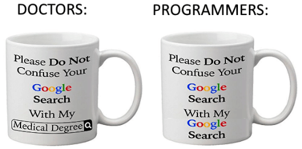

Golden Rules of Coding (for Classwork
================
Sarah Jewett
2022

The following tips and instructions are based on common errors students
have made in the past. The benefit of following them is in becoming a
strong coder, easy to collaborate with, and more prone to get partial
credit for incorrect answers in assignments.

## Notable Functions

Ingrain these in your coding practice as they will become your good
friends and make your instructors very happy:

##### head() and tail()

This will give you the first and last parts of the data.

##### options(scipen = 999)

This disables scientific notation in R, which can sometimes appear at
inconvenient times (such as in plots) or with one variable of the data
but not others.

##### suppressMessages()

This will eliminate the messages from loading your packages in your
document.

------------------------------------------------------------------------

## R chunk options

R chunks start with \`\`\`{r} and end with \`\`\`
[(resource)](https://rmarkdown.rstudio.com/lesson-3.html)

You can create a chunk with a keyboard shortcut: Ctrl + Alt + I (OS X:
Cmd + Option + I)

You can then use knitr syntax to make each chunk behave a certain way:

- **error = TRUE**
  - tells RMarkdown to ignore errors that would otherwise prevent the
    file knitting. Useful when chunk runs within R Studio, but when
    knitting there is an issue that otherwise doesn’t affect the rest of
    your code.
- **fig.cap = “…”**
  - adds a caption to visualizations

*Useful for Packages:*

- **warning = FALSE**
  - prevents warnings that are generated by code from appearing in the
    knitted file.
- **message = FALSE**
  - won’t print messages from code in the knitted file

*USE SPARINGLY – Hiding your results or code can mean getting points
taken off:*

- **include = FALSE **
  - code and results won’t appear in the knitted file. It still means it
    runs therefore results are accessible by other chunks.
- **echo = FALSE**
  - results from your code appear in knitted file but not the code. This
    is useful when you don’t need the code for, say, a plot or want a
    cleaner look

------------------------------------------------------------------------

## Good Coding Practices

There are packages like lintr() that help with spelling and continuity
in code style within R. There are also style guides you can follow:

[RStudio Style
Guide](https://rstudio-pubs-static.s3.amazonaws.com/390511_286f47c578694d3dbd35b6a71f3af4d6.html)
\| [tidyverse Style Guide](https://style.tidyverse.org) \| [Google R
Style Guide](https://google.github.io/styleguide/Rguide.html)

##### Naming Variables

Try to name your variables and data something descriptive and avoid
meaningless numbers. As your code gets more complicated, it’s vital not
to have to keep scrolling up to remember what variable is doing or means
what.

##### Comment Your Code

Think about how hard it is to learn new code without any comments, and
imagine having to do that over and over.

- Comenting your code ensures:
  - The grader knows your intent behind the code and easily correct you
    if you are mistaken.
  - Signals you understood what was requested and the point of the
    exercise.
  - A quick understanding of what you did if you need to revisit it in
    order to repeat an approach later on.

##### Show Your Work

- Don’t assume the person grading your work will know what your data
  look like from your code alone. Use head() or other functions to
  illustrate how your data manipulation/scraping progressed.

- **NEVER** print the entirety of your large data frames, it defeats the
  purpose of working in R and creates endless scrolling. This is a huge
  mistake!

- Hidden data + unreproducible code = suspicious grader

------------------------------------------------------------------------

## Presentation of Findings

##### Imagine your submission as if you will use it to present in a seminar or formal academic setting

- Would incomplete data or poor visuals be acceptable in these contexts?
  **NO.**
  - *Example 1:* The question asks for the name of someone, but your
    output gives an ID number because you haven’t finished cleaning or
    linking data.
  - *Example 2:* A plot is missing labels or legends/keys, requiring a
    written answer to interpret.
- Visualizations need to be mostly interpretable as a stand-alone.

##### Interpret Your Results

- A question requiring you to explain results does not mean repeating
  the output in a sentence.
  - *Bad:* The correlation is -.002 and non-significant.
  - *Better: *The correlation of -.002 is weak. The lack of statistical
    significance underlines that there is no relationship or correlation
    between the two variables of interest.
- Do not assume that your data visualization conveys statistical
  significance! You could have a plot that suggests a strong correlation
  and an impressive finding, but a significance test shows there is no
  such significance after all.

------------------------------------------------------------------------

## Don’t Rush or Wait to Code at the Last Minute

Think of your brain like a computer – it can process tasks in the
background, and that includes figuring out how to get unstuck in R!

But, unlike writing an essay, when code doesn’t run, there is no fudging
it. Most students, particularly those new to R, don’t thrive coding
under last-minute pressure, particularly because of this.

Rushing compromises your ability to learn how to code properly, without
cutting corners.

It also means that when you are stuck earlier on, the instructors are
available to help you. We can’t, however, come to your rescue at 2am the
night before the deadline.

## Learning to Troubleshoot

Documentation in R is great, but sometimes it can be too abstract.
Learning how to effectively google any error warnings you have, or for
external resources that might make things “click” for you and how you
learn is important. Sites like stackoverflow and stackexchange are
filled with users asking questions as to why their code isn’t working,
and you may find googling your exact error message leads to someone else
asking what it means.

So, don’t feel bad that you need to Google! There’s a reason this
popular programming meme exists:

**Note:** If you are answering by using someone else’s code, it’s
important to cite your source, otherwise it is potentially code
plagiarism. NEVER post questions from assignments or exams online to get
someone else to answer them for you either!

## Last but not least… when in doubt, Restart R and make sure R and RStudio are up to date!
