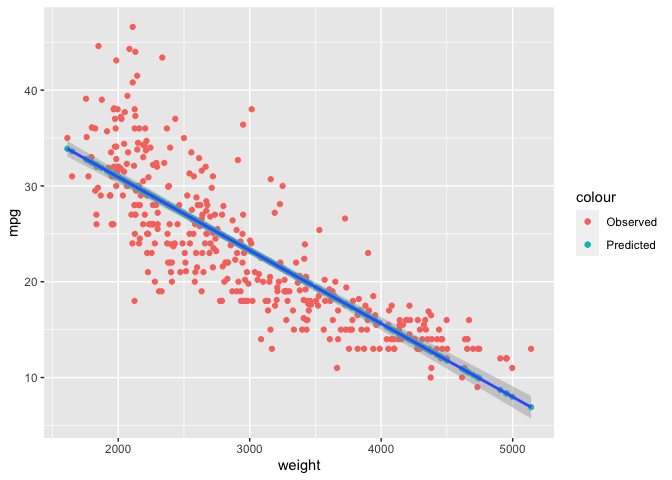
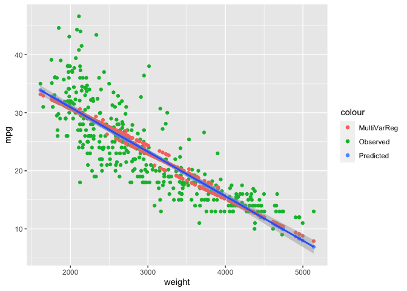

Midterm Review
================
Sarah Jewett

``` r
library(stargazer)
library(dplyr)
library(ggplot2)
data("Auto", package = "ISLR")
Auto$name <- as.factor(Auto$name)
```

## Regression

### Predicted Probabilities

Say we want to see the predicted probabilities for the first few rows of
the Auto data based on a linear regression model with only two
independent variables:

``` r
lm.1 <- lm(mpg ~ cylinders + weight, Auto)
summary(lm.1)
```

    ## 
    ## Call:
    ## lm(formula = mpg ~ cylinders + weight, data = Auto)
    ## 
    ## Residuals:
    ##      Min       1Q   Median       3Q      Max 
    ## -12.6469  -2.8282  -0.2905   2.1606  16.5856 
    ## 
    ## Coefficients:
    ##               Estimate Std. Error t value Pr(>|t|)    
    ## (Intercept) 46.2923105  0.7939685  58.305   <2e-16 ***
    ## cylinders   -0.7213779  0.2893780  -2.493   0.0131 *  
    ## weight      -0.0063471  0.0005811 -10.922   <2e-16 ***
    ## ---
    ## Signif. codes:  0 '***' 0.001 '**' 0.01 '*' 0.05 '.' 0.1 ' ' 1
    ## 
    ## Residual standard error: 4.304 on 389 degrees of freedom
    ## Multiple R-squared:  0.6975, Adjusted R-squared:  0.6959 
    ## F-statistic: 448.4 on 2 and 389 DF,  p-value: < 2.2e-16

We can use predict() to see what the car’s predicted mpg is based on the
above coefficients

``` r
predict(lm.1, newdata = Auto[1:6,], type = "response")
```

    ##        1        2        3        4        5        6 
    ## 18.28101 17.08141 18.71261 18.73166 18.63010 12.96848

``` r
# OR
lm.1$fitted.values[1:6] 
```

    ##        1        2        3        4        5        6 
    ## 18.28101 17.08141 18.71261 18.73166 18.63010 12.96848

Our predicted MPG for the first row is 18.28101

Let’s see how we get this predicted MPG:

First we pull out the relevant coefficients from lm.1:

``` r
intercept      <- 46.2923105
beta_cylinders <- -0.7213779
beta_weight    <- -0.0063471

# OR

intercept      <- lm.1$coefficients[1]
beta_cylinders <- lm.1$coefficients[2]
beta_weight    <- lm.1$coefficients[3]
```

This is: **MPG = 46.29 + -0.72\*cylinders + –0.006\*weight**

Let’s take a look at the first row and see what the values are in the
data:

``` r
Auto[1,]
```

    ##   mpg cylinders displacement horsepower weight acceleration year origin
    ## 1  18         8          307        130   3504           12   70      1
    ##                        name
    ## 1 chevrolet chevelle malibu

**MPG = 46.29 + -0.7213779\*8 + -0.0063471\*3504**

Our predicted MPG was: 18.28101 Does this match?

``` r
predicted_mpg <- intercept + beta_cylinders*Auto$cylinders[1] + beta_weight*Auto$weight[1]

unname(predicted_mpg)
```

    ## [1] 18.28101

``` r
# unname() takes away the name from 'Named number' values, which this is. 
```

Now, we can have fun and easily plot our original mpg values with the
fitted values. We will also add the regression line like in Assignment 3
to see how the predicted values plot compared to when we do lm() within
a plot with our data.

``` r
lm.3 <- lm(mpg ~ weight, Auto)
summary(lm.3)
```

    ## 
    ## Call:
    ## lm(formula = mpg ~ weight, data = Auto)
    ## 
    ## Residuals:
    ##      Min       1Q   Median       3Q      Max 
    ## -11.9736  -2.7556  -0.3358   2.1379  16.5194 
    ## 
    ## Coefficients:
    ##              Estimate Std. Error t value Pr(>|t|)    
    ## (Intercept) 46.216524   0.798673   57.87   <2e-16 ***
    ## weight      -0.007647   0.000258  -29.64   <2e-16 ***
    ## ---
    ## Signif. codes:  0 '***' 0.001 '**' 0.01 '*' 0.05 '.' 0.1 ' ' 1
    ## 
    ## Residual standard error: 4.333 on 390 degrees of freedom
    ## Multiple R-squared:  0.6926, Adjusted R-squared:  0.6918 
    ## F-statistic: 878.8 on 1 and 390 DF,  p-value: < 2.2e-16

``` r
Auto$pred <- unname(lm.3$fitted.values)

ggplot(Auto, aes(y = mpg, x = weight)) + 
  geom_point(aes(color = "Observed")) +
  geom_point(aes(y = pred, color = "Predicted")) +
  geom_smooth(method = lm)
```

    ## `geom_smooth()` using formula = 'y ~ x'

<!-- -->

Now if we want to start looking at how adding variables changes from the
original regression line we can add points from our earlier regression
on mpg with weight and cylinders

``` r
Auto$pred2 <- unname(lm.1$fitted.values)

ggplot(Auto, aes(y = mpg, x = weight)) + 
  geom_point(aes(color = "Observed")) +
  geom_point(aes(y = pred, color = "Predicted")) +
  geom_point(aes(y=pred2, color = "MultiVarReg")) +
    geom_smooth(method = lm)
```

    ## `geom_smooth()` using formula = 'y ~ x'

<!-- -->

### Interactions!

When don’t use interactions, we are assuming that the independent
variables are, well, independent to each other. An interaction is
looking at, say, how x1’s impact on y depends on x1’s relationship with
x2.

Imagine we are looking at whether people like peanut butter or jelly. If
we only look at the two spreads independently, we might miss that many
people actual PREFER to eat peanut butter and jelly together and that
their level of enjoyment increases when they eat them together.

If we have a sample from a survey of people across a few days days at a
hotel asking if they enjoyed their breakfast or not, we can see how this
PB&J situation might look in the data. Imagine we also asked what they
ate for breakfast, with a bunch of foods including peanut butter and
jelly. We also know that on one day that they ran out of peanut butter
at some point and on another day, they ran out of jelly.

Enjoyment is measured from 1-10, with 6 being the threshold for being
able to say they enjoyed the meal. (This is just to avoid a binary
dependent variable, even though we are going to more or less consider it
as such).

So say we have: 12 people who ate PB & Jelly (all but 1 enjoyed their
breakfast) 5 people who ate PB (1 enjoyed their breakfast) 5 people who
ate jelly (4 enjoyed their breakfast) 4 people who ate neither (and all
enjoyed their breakfast)

We create a data frame:

``` r
food <- data.frame(PB =    c(1, 1, 1, 1, 1, 1, 1, 1, 1, 1, 1, 1,  1, 1, 1, 1, 1,  0, 0, 0, 0, 0,  0, 0, 0, 0),
                   Jelly = c(1, 1, 1, 1, 1, 1, 1, 1, 1, 1, 1, 1,  0, 0, 0, 0, 0,  1, 1, 1, 1, 1,  0, 0, 0, 0),
                   Enjoy = c(8, 7, 9, 3, 8, 9, 9, 6, 8, 6, 7, 8,  1, 5, 6, 2, 3,  7, 7, 3, 9, 8,  7, 8, 6, 8))
```

And now we can run three different linear models, two of which include
interactions.

- Using \* will run a model with independent variables AND the
  interaction
- Using : will remove the independent variables from the model and only
  look at the interaction

So if we decide to look at the impact of whether a person had peanut
butter and jelly on their enjoyment rating…

First a basic regression

``` r
lm.no_inter <- lm(Enjoy ~ Jelly + PB, food)
```

This keeps the independent variables and the interactions (identical
ways of doing this but with \* and :)

``` r
lm.all_inter <-   lm(Enjoy ~ Jelly * PB, food)
lm.all_inter2 <-  lm(Enjoy ~ Jelly + PB + Jelly:PB, food)
```

but not the same as:

``` r
lm.inter_only <-  lm(Enjoy ~ Jelly:PB, food)
```

Let’s look at them side by side (using stargazer package, shows in knit
HTML only):

``` r
stargazer(lm.no_inter, lm.all_inter, lm.inter_only, type = "html")
```

<table style="text-align:center">
<tr>
<td colspan="4" style="border-bottom: 1px solid black">
</td>
</tr>
<tr>
<td style="text-align:left">
</td>
<td colspan="3">
<em>Dependent variable:</em>
</td>
</tr>
<tr>
<td>
</td>
<td colspan="3" style="border-bottom: 1px solid black">
</td>
</tr>
<tr>
<td style="text-align:left">
</td>
<td colspan="3">
Enjoy
</td>
</tr>
<tr>
<td style="text-align:left">
</td>
<td>
\(1\)
</td>
<td>
\(2\)
</td>
<td>
\(3\)
</td>
</tr>
<tr>
<td colspan="4" style="border-bottom: 1px solid black">
</td>
</tr>
<tr>
<td style="text-align:left">
Jelly
</td>
<td>
2.240<sup>\*\*</sup>
</td>
<td>
-0.450
</td>
<td>
</td>
</tr>
<tr>
<td style="text-align:left">
</td>
<td>
(0.868)
</td>
<td>
(1.225)
</td>
<td>
</td>
</tr>
<tr>
<td style="text-align:left">
</td>
<td>
</td>
<td>
</td>
<td>
</td>
</tr>
<tr>
<td style="text-align:left">
PB
</td>
<td>
-1.160
</td>
<td>
-3.850<sup>\*\*\*</sup>
</td>
<td>
</td>
</tr>
<tr>
<td style="text-align:left">
</td>
<td>
(0.868)
</td>
<td>
(1.225)
</td>
<td>
</td>
</tr>
<tr>
<td style="text-align:left">
</td>
<td>
</td>
<td>
</td>
<td>
</td>
</tr>
<tr>
<td style="text-align:left">
Jelly:PB
</td>
<td>
</td>
<td>
4.383<sup>\*\*</sup>
</td>
<td>
1.619<sup>\*</sup>
</td>
</tr>
<tr>
<td style="text-align:left">
</td>
<td>
</td>
<td>
(1.564)
</td>
<td>
(0.863)
</td>
</tr>
<tr>
<td style="text-align:left">
</td>
<td>
</td>
<td>
</td>
<td>
</td>
</tr>
<tr>
<td style="text-align:left">
Constant
</td>
<td>
5.756<sup>\*\*\*</sup>
</td>
<td>
7.250<sup>\*\*\*</sup>
</td>
<td>
5.714<sup>\*\*\*</sup>
</td>
</tr>
<tr>
<td style="text-align:left">
</td>
<td>
(0.845)
</td>
<td>
(0.913)
</td>
<td>
(0.586)
</td>
</tr>
<tr>
<td style="text-align:left">
</td>
<td>
</td>
<td>
</td>
<td>
</td>
</tr>
<tr>
<td colspan="4" style="border-bottom: 1px solid black">
</td>
</tr>
<tr>
<td style="text-align:left">
Observations
</td>
<td>
26
</td>
<td>
26
</td>
<td>
26
</td>
</tr>
<tr>
<td style="text-align:left">
R<sup>2</sup>
</td>
<td>
0.248
</td>
<td>
0.446
</td>
<td>
0.128
</td>
</tr>
<tr>
<td style="text-align:left">
Adjusted R<sup>2</sup>
</td>
<td>
0.183
</td>
<td>
0.370
</td>
<td>
0.092
</td>
</tr>
<tr>
<td style="text-align:left">
Residual Std. Error
</td>
<td>
2.081 (df = 23)
</td>
<td>
1.827 (df = 22)
</td>
<td>
2.194 (df = 24)
</td>
</tr>
<tr>
<td style="text-align:left">
F Statistic
</td>
<td>
3.792<sup>\*\*</sup> (df = 2; 23)
</td>
<td>
5.898<sup>\*\*\*</sup> (df = 3; 22)
</td>
<td>
3.519<sup>\*</sup> (df = 1; 24)
</td>
</tr>
<tr>
<td colspan="4" style="border-bottom: 1px solid black">
</td>
</tr>
<tr>
<td style="text-align:left">
<em>Note:</em>
</td>
<td colspan="3" style="text-align:right">
<sup>*</sup>p\<0.1; <sup>**</sup>p\<0.05; <sup>***</sup>p\<0.01
</td>
</tr>
</table>

So the regression output, without the interaction, shows a negative
relationship with PB and enjoyment. However, we know in the observed
data, that people who had peanut butter AND jelly, enjoyed their
breakfast except for one person. This can lead us to believe that having
PB on it’s own will lead to lower ratings of breakfast enjoyment, which
isn’t untrue if you look only at the people who ate just peanut butter.
In short, this isn’t capturing the relationship between PB & Jelly as a
combination in enjoyment.

When we look at the regression with the interaction, we can see that
suddenly the relationship with enjoyment and PB becomes worse, BUT the
interaction rightfully captures that many people who had PB & J enjoyed
their meal more. So in this sense, it is illustrating that when people
have PB on its own, they they tend to enjoy their meal less, but when
they have PB & J together, they are more likely to enjoy their meal.

You can look at jelly the same way – without the interaction, having
jelly has a positive relationship with enjoyment. But with the
interaction, it actually gets worse, even though for the most part,
people enjoyed their meal when only having jelly.

We can further demystify this by looking at the predicted probability of
a specific case, in this instance, the first row observation in the data
we created which is someone who had peanut butter and jelly.

``` r
predicted.ind <- lm.no_inter$coefficients[1] + # this is the constant/intercept
                 lm.no_inter$coefficients[2]*food$Jelly[1] + # this is beta of Jelly * Jelly (observed)
                 lm.no_inter$coefficients[3]*food$PB[1] # this is beta of PB * PB (observed)

predicted.ind_int <- lm.all_inter$coefficients[1] + # this is the constant/intercept
                     lm.all_inter$coefficients[2]*food$Jelly[1] + #  # this is beta of Jelly * Jelly (observed)
                     lm.all_inter$coefficients[3]*food$PB[1] + # this is beta of PB * PB (observed)
                     lm.all_inter$coefficients[4]*food$Jelly[1]*food$PB[1] # this is beta of interaction * Jelly (observed) AND * PB (observed)

sprintf("The non-interaction model shows a predicted rating of %g for PB&J and the model with the interaction shows a predicted rating of %g for PB&J\n", 
        unname(predicted.ind), unname(predicted.ind_int)) %>% 
    cat()
```

    ## The non-interaction model shows a predicted rating of 6.83523 for PB&J and the model with the interaction shows a predicted rating of 7.33333 for PB&J

So what about if they only had jelly, what is the predicted enjoyment
rating?

Easier to just create a new df with the 4 possibilities and see the
predictions using pred()

``` r
new_food <- data.frame(PB    = c(1, 1, 0, 0),
                       Jelly = c(1, 0, 1, 0))

predict(lm.no_inter, new_food, type = "response")
```

    ##        1        2        3        4 
    ## 6.835227 4.595455 7.995455 5.755682

``` r
# Highest predicted rating goes to Jelly only here
predict(lm.all_inter, new_food, type = "response")
```

    ##        1        2        3        4 
    ## 7.333333 3.400000 6.800000 7.250000

``` r
# Highest predicted rating goes to PB & J here
```

This is showing that without the interaction, people having only jelly
are predicted to have a higher enjoyment rating on average than those
who had both peanut butter and jelly.

The interaction model, however, adjusts for this relationship between
the two. So the now negative coefficient for jelly actually brings the
predicted rating down to 6.8, which is lower than the interaction model
for PB & J (7.33)

This is a saturated model so you may have noticed that the predicted
ratings for the interaction model match the mean for each of the four
possible options. We can see what the observed means for the four
groupings like so:

``` r
enjoy_mean <- food %>% 
    group_by(across(c(PB, Jelly))) %>% 
    summarize(Mean = mean(Enjoy))
```

    ## `summarise()` has grouped output by 'PB'. You can override using the `.groups`
    ## argument.

``` r
enjoy_mean
```

    ## # A tibble: 4 × 3
    ## # Groups:   PB [2]
    ##      PB Jelly  Mean
    ##   <dbl> <dbl> <dbl>
    ## 1     0     0  7.25
    ## 2     0     1  6.8 
    ## 3     1     0  3.4 
    ## 4     1     1  7.33

## Manipulating your observations before regressing:

Say we wanted to take all of the numeric values and sqrt them before
running the regression. There are a number of reasons why you might want
to do this, which you can read about
[here.](https://quantifyinghealth.com/square-root-transformation/)

A long way:

``` r
sqrt_Auto <- Auto %>%
  mutate(sqrt_mpg = sqrt(mpg)) %>%
  mutate(sqrt_cylinders = sqrt(cylinders)) %>%
  mutate(sqrt_displacement = sqrt(displacement)) %>%
  mutate(sqrt_horsepower = sqrt(horsepower)) %>%
  mutate(sqrt_weight = sqrt(weight)) %>%
  mutate(sqrt_acceleration = sqrt(acceleration))

head(sqrt_Auto)
```

    ##   mpg cylinders displacement horsepower weight acceleration year origin
    ## 1  18         8          307        130   3504         12.0   70      1
    ## 2  15         8          350        165   3693         11.5   70      1
    ## 3  18         8          318        150   3436         11.0   70      1
    ## 4  16         8          304        150   3433         12.0   70      1
    ## 5  17         8          302        140   3449         10.5   70      1
    ## 6  15         8          429        198   4341         10.0   70      1
    ##                        name     pred    pred2 sqrt_mpg sqrt_cylinders
    ## 1 chevrolet chevelle malibu 19.42024 18.28101 4.242641       2.828427
    ## 2         buick skylark 320 17.97489 17.08141 3.872983       2.828427
    ## 3        plymouth satellite 19.94026 18.71261 4.242641       2.828427
    ## 4             amc rebel sst 19.96320 18.73166 4.000000       2.828427
    ## 5               ford torino 19.84084 18.63010 4.123106       2.828427
    ## 6          ford galaxie 500 13.01941 12.96848 3.872983       2.828427
    ##   sqrt_displacement sqrt_horsepower sqrt_weight sqrt_acceleration
    ## 1          17.52142        11.40175    59.19459          3.464102
    ## 2          18.70829        12.84523    60.77006          3.391165
    ## 3          17.83255        12.24745    58.61740          3.316625
    ## 4          17.43560        12.24745    58.59181          3.464102
    ## 5          17.37815        11.83216    58.72819          3.240370
    ## 6          20.71232        14.07125    65.88627          3.162278

Or we can do it with dplyr’s across() function:

``` r
s_Auto <- Auto %>% 
  mutate(across(c(mpg, cylinders, displacement, horsepower, weight, acceleration), sqrt, .names = "sqrt_{.col}"))

head(s_Auto)
```

    ##   mpg cylinders displacement horsepower weight acceleration year origin
    ## 1  18         8          307        130   3504         12.0   70      1
    ## 2  15         8          350        165   3693         11.5   70      1
    ## 3  18         8          318        150   3436         11.0   70      1
    ## 4  16         8          304        150   3433         12.0   70      1
    ## 5  17         8          302        140   3449         10.5   70      1
    ## 6  15         8          429        198   4341         10.0   70      1
    ##                        name     pred    pred2 sqrt_mpg sqrt_cylinders
    ## 1 chevrolet chevelle malibu 19.42024 18.28101 4.242641       2.828427
    ## 2         buick skylark 320 17.97489 17.08141 3.872983       2.828427
    ## 3        plymouth satellite 19.94026 18.71261 4.242641       2.828427
    ## 4             amc rebel sst 19.96320 18.73166 4.000000       2.828427
    ## 5               ford torino 19.84084 18.63010 4.123106       2.828427
    ## 6          ford galaxie 500 13.01941 12.96848 3.872983       2.828427
    ##   sqrt_displacement sqrt_horsepower sqrt_weight sqrt_acceleration
    ## 1          17.52142        11.40175    59.19459          3.464102
    ## 2          18.70829        12.84523    60.77006          3.391165
    ## 3          17.83255        12.24745    58.61740          3.316625
    ## 4          17.43560        12.24745    58.59181          3.464102
    ## 5          17.37815        11.83216    58.72819          3.240370
    ## 6          20.71232        14.07125    65.88627          3.162278

Note: Remove the ‘.names’ argument if you want to overwrite the columns
